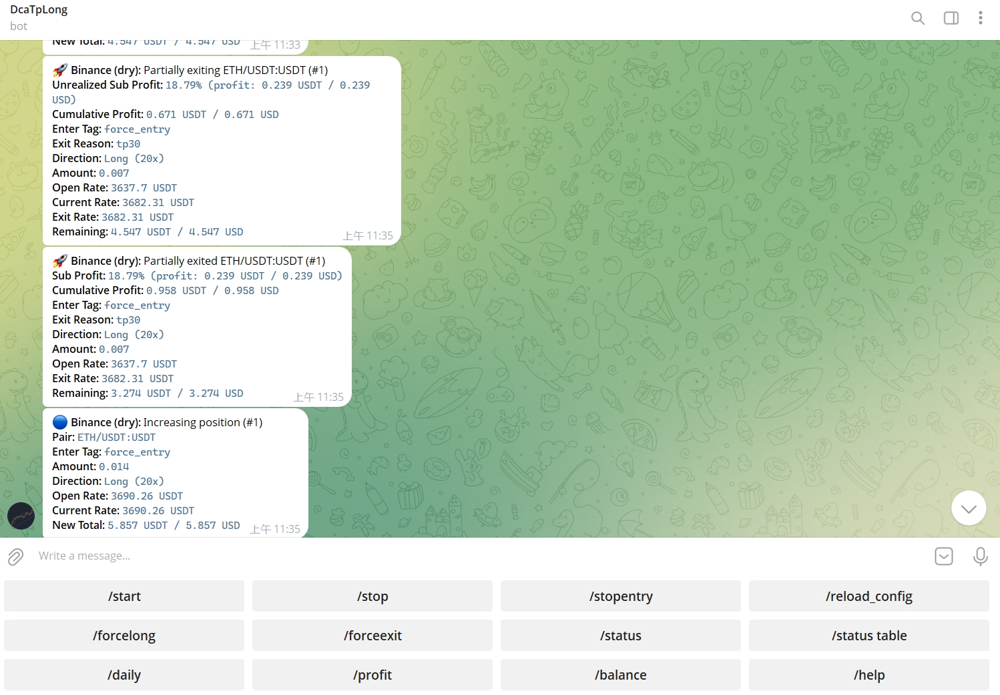

## DcaTp策略概述

此项目是基于freqtrade框架研发的策略，目的是同時持有多空倉位，依靠波动获得高低差利润，类似中性网格，配置默认有三個个交易机器人，如有需要，请自行参考设置。

若要使用，請將DcaTpLong复制到strategies目录下，config配置可供参考，docker-compose设置端口号（默认为8000，8001和8002）。可同时持有不同交易对的多空仓位。该版本为开发版，后续将会更新完整的实盘数据。leverage：杠杆大小，stake_amount：初始资金，tradable_balance_ratio：资金占用率，pair_whitelist：交易对白名单。

优点：
同时运行多个不同策略或方向的交易机器人
可根据风险偏好调整杠杆，止盈条件和仓位大小。
可优化MACD,KDJ,EMA,RSI指标和加减仓参数。

缺点：
无固定止损，最大风险为强平。
指标设置，成交逻辑不一定最优。


## 安装(以docker为例)

#### 详情参考[freqtrade官方文档](https://www.freqtrade.io/en/stable/docker_quickstart/)

```
mkdir ft_userdata
cd ft_userdata/
# 克隆yml文件
curl https://raw.githubusercontent.com/freqtrade/freqtrade/stable/docker-compose.yml -o docker-compose.yml
# 拉取docker镜像
docker compose pull
# 启动交易机器人
docker compose up -d
# 建立使用者目录
docker compose run --rm freqtrade create-userdir --userdir user_data
# 建立config配置
docker compose run --rm freqtrade new-config --config user_data/config.json
```

## 使用
```
# 查看可下载的时间戳
docker-compose run --rm freqtrade list-timeframes
# 下载 OHLCV 数据（以30m为例）
docker-compose run --rm freqtrade download-data --exchange binance --timeframe 30m --timerange
# 列出可用数据
docker-compose run --rm freqtrade list-data --exchange binance
# 传递标志所需的可用数据
docker-compose run --rm freqtrade list-data --exchange binance
# 回测数据
docker-compose run --rm freqtrade backtesting --datadir user_data/data/binance --export trades --stake-amount 10 -s DcaTpLong -i 30m
```


## Telegram RPC 

#### 更多指令请参阅[文件](https://www.freqtrade.io/en/latest/telegram-usage/)

- `/start`: 启动交易
- `/stop`: 关闭交易
- `/stopentry`: 停止新的交易
- `/reload_config`: 加载config配置
- `/forcelong`: 立即开多
- `/forceshort`: 立即开空
- `/forceexit`: 立即退出



## 策略介绍

#### 趋势加仓

MACD、KDJ 金叉、ADX>25、EMA9>EMA21>EMA99且为盈利状态时（current_profit>0），加仓 60%，KDJ死叉减仓30%。

#### 空头信号止损（可选）

MACD、KDJ 死叉、ADX>25、EMA9<EMA21<EMA99时，减仓50%

#### 趋势回撤加仓

价格回落到14根k线中收盘价最高的k线的0.99且EMA9>EMA21>EMA99时，加仓30%

#### 浮亏 DCA 加仓

基于动态平均入场价，跌破 1−(0.01+dca_count×0.01)（dca_count 浮虧为加仓次数），且 RSI<39，加仓 30%，触发浮亏止盈重置dca_count。

#### 浮盈 TP 加仓

触发止盈后首次浮盈 tp_count=1 加仓60%，后续仍止盈无回撤 tp_count >=2 加仓80%。
觸發止盈回撤重置tp_count

#### 分批止盈

已有 DCA（dca_count>0），按 0.3+0.1×dca_count 减仓；
已有 TP（tp_count>0），减仓30%，标记可浮盈加仓

#### 浮盈后回撤减仓

已有 TP（tp_count>0），且持仓浮盈跌回至 1% 以下时，按 0.2+0.5×tp_count(浮盈加仓次数) 减仓。

#### 浮盈回落加仓

当前价格回落至止盈价的 99%时，加仓 10%。

#### 抄底/逃顶

抄底： KDJ_J<0 且 RSI<35 时，加仓 50%。
逃顶： KDJ_J>100 且 RSI>70 时，减仓 50%。
价格回落到布林中轨才会重置信号，避免反复触发

#### 低保证金补仓
当前保证金 < 10 USDT（可自行设置）且已持续 3h时，加仓至10 USDT。

#### 16h DCA 后减仓

DCA 持续 16 小时以上，价格突破布林上轨减仓 30%。


## 免责声明

本策略仅供参考用途，勿将担心损失的资金用于冒险，使用本策略的风险由您自行承担。强烈建议先在 Dry-run 中运行交易机器人，在了解其工作原理以及您应该预期的利润/损失之前，不要投入资金。
#### 不足和待完善之处请谅解！源码仅供学习建议


